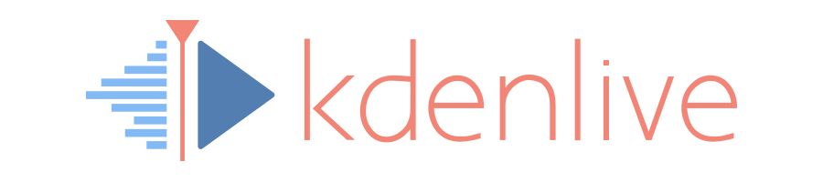

# Kdenlive

Kdenlive is a powerful, free and open-source video editor that brings professional-grade video editing capabilities to everyone. Whether you're creating a simple family video or working on a complex project, Kdenlive provides the tools you need to bring your vision to life.

## Edit Path trajectory capture and reconstruction

This fork adds an opt-in recording and reconstruction system for producing
auditable video-editing trajectories and deterministic training samples. It
records semantic timeline changes and exact Kdenlive/MLT project states; it
does not attempt to reproduce a session by replaying mouse gestures or keyboard
timing.
The MVP does not ask editors for plans, explanations, decisions, or creative
intent. The internal team adds the task prompt later when preparing client
samples.

The production pipeline is:

```text
JSONL trajectory + content-addressed assets + exact state sidecars
  -> validate session, semantic hashes, and global project hash chain
  -> resolve the accepted commit/undo/redo branch
  -> reconstruct and validate every captured checkpoint
  -> render and validate the final accepted state with pinned Melt/MLT and FFmpeg
  -> reconstruct every raw command, shortcut, gesture, and state change in a full editor training view
  -> gate final-state media on structure, duration, audio structure, and video SSIM
  -> atomically publish an accepted sample or a detailed quarantine bundle
```

Schema 0.3 recordings include stable entity IDs, transaction and undo-entry
IDs, project profile/tool context, compressed content-addressed project states,
capture-time checkpoint proxies, and explicit abort/recovery lifecycle events.
The readers remain backward-compatible with schema 0.1 and 0.2 trajectories
and finalized legacy sample directories.

### Platform support

| Platform | Editor collection | Reconstruction | Distribution status |
| --- | --- | --- | --- |
| Windows 10/11 x64 | `EditPath.exe` launches the adjacent instrumented `kdenlive.exe` | Embedded Python plus packaged Melt/FFmpeg | Primary portable engineering build; unsigned |
| Linux x64 | Native source build and `run-collector-app.sh` | Native tools or the pinned Docker image | Fully validated development path |
| macOS | Native source build using the upstream Kdenlive dependencies | Native tools or Docker Desktop | Developer path; no signed app bundle yet |

The normal editor entry point is the **EditPath supervisor**, not Kdenlive
directly. Direct Kdenlive launches still work, but recording is disabled unless
the supervisor supplies the recorder environment.

### Run on Windows

Use a portable artifact produced by the **Windows portable MVP** workflow, or
build one from a 64-bit Windows PowerShell session:

```powershell
Set-ExecutionPolicy -Scope Process Bypass
.\packaging\windows\build-editpath.ps1 -PreflightOnly
.\packaging\windows\build-editpath.ps1
```

Extract `windows-output\EditPath-Windows-x64.zip`, confirm
`SELF-TEST.json` reports `"passed": true`, and run:

```text
bin\EditPath.exe
```

Do not start `bin\kdenlive.exe` directly for collection. The portable package
contains Kdenlive, Melt/MLT, FFmpeg/FFprobe, the Python reconstruction package,
and its required Python dependency. Detailed prerequisites and failure-handling
instructions are in [`WINDOWS_BUILD.md`](WINDOWS_BUILD.md).

### Run on Linux

Install the normal Kdenlive build dependencies documented in
[`dev-docs/build.md`](dev-docs/build.md), plus Ninja, Python 3.10+, Zstandard,
Melt/MLT 7.38+, FFmpeg and FFprobe. Install the complete MLT plugin set used by
Kdenlive; at minimum reconstruction needs `avformat`, `xml`, and `qimage` or
`pixbuf`. Frei0r, AVFilter, `kdenlivetitle`, Glaxnimate, and an SDL/RtAudio
backend are needed when the project uses those capabilities.

On openSUSE/WSL, the QtMultimedia QML import is also mandatory for Kdenlive's
timeline. The supervisor now refuses to start a broken editor instead of
allowing the missing import to become a later Qt crash:

```bash
sudo zypper --non-interactive install \
  qt6-multimedia-imports libmlt7-modules libmlt7-module-qt6 frei0r-plugins
```

```bash
python3 -m venv .venv
. .venv/bin/activate
python -m pip install -e .
cmake -S . -B build -GNinja -DBUILD_TESTING=OFF
cmake --build build --parallel
python -m edit_path doctor
./video-path-pilot/run-collector-app.sh
```

If dependencies come from KDE Craft rather than system paths, set the location
before running the launcher:

```bash
export KDENLIVE_PILOT_CRAFT_ROOT=/absolute/path/to/CraftRoot
./video-path-pilot/run-collector-app.sh
```

For recorder diagnostics without the supervisor, use a fresh absolute JSONL
path:

```bash
./video-path-pilot/run-video-path-pilot.sh /absolute/path/session-001.jsonl
```

### Run on macOS

macOS currently uses a source build. Install the Qt/KDE/MLT/FFmpeg dependencies
from the upstream build guide, create the Python environment shown above, and
build both applications:

```bash
cmake -S . -B build -GNinja -DBUILD_TESTING=OFF
cmake --build build --parallel
python3 -m edit_path doctor
EDIT_PATH_REPO_ROOT="$PWD" ./build/bin/EditPath
```

`run-collector-app.sh` may also be used when the dependencies are discoverable
by CMake. This path has no notarized or signed package yet, so it is intended
for developer testing rather than editor distribution.

### What happens during a collection

1. EditPath creates an isolated session under the user's Videos/Movies folder,
   writes `session.json`, and launches instrumented Kdenlive with a stable
   session ID and a session-owned `edit.kdenlive` project.
2. Recorder hooks capture schema-0.3 semantic state changes, transaction and
   undo/redo identities, exact compressed Kdenlive/MLT states, project context,
   and independent checkpoint proxies. UI events remain audit evidence.
3. If Kdenlive stops unexpectedly, existing evidence remains immutable.
   **Resume Editing** reopens the same project and configuration, retains
   stable entity IDs, and records the continuation as a new numbered segment.
4. The editor renders one independent final video into the displayed session
   folder and closes Kdenlive normally. The accepted extensions are `.mp4`,
   `.mov`, `.mkv`, and `.webm`; H.264 is not required. There must be exactly
   one top-level rendered video in the session folder.
5. **Create Dataset Sample** discovers and hashes project assets, assembles recovery
   segments, resolves the accepted commit/undo/redo branch, and reconstructs
   from the exact accepted project state—not from mouse/keyboard replay.
6. Melt first renders a validation file matched to the independent editor
   render, then creates `verification/reconstructed.mp4` with the first available supported
   encoder (`libx264`, `libopenh264`, then `mpeg4`). FFprobe rejects an
   audio-only encoder "success". FFmpeg compares structure, duration, audio,
   and video SSIM. The pipeline then joins the raw UI evidence to each exact
   before/after state and renders a full nonlinear-editor replay as `edit-path/replay.mp4`:
   project bin, monitor, effects/properties, multitrack timeline, selections,
   cursor motion, shortcuts, command feedback, and semantic apply events. Passing
   samples are atomically published; failures are quarantined with the precise
   gate and sequence.

The finished dataset item is under the displayed session's
`completed-sample/` directory. `sample.json` is its authoritative entry point;
source media is under `inputs/`, the editor target under `outputs/`, the
normalized path and replay under `edit-path/`, derived QA under
`verification/`, and native audit material under `provenance/`. See
[`DATASET_ITEM.md`](DATASET_ITEM.md) for the complete layout.

For long-lived WSL GUI containers, create the container with `docker run
--init ...` so a tiny init process reaps Kdenlive render children. The recorder
uses a dedicated single-thread sidecar pool with a bounded queue (two pending
states by default), reaps completed work during the session, flushes every
event, and updates the supervisor manifest heartbeat every 60 seconds. Override
the queue only for diagnostics with `KDENLIVE_VIDEO_PATH_MAX_PENDING_SIDECARS`
(accepted range 1-8).

### Reconstruct and assemble the dataset

The `edit-path` CLI implements validation, reconstruction, atomic publication,
multi-worker queue claiming, dataset indexing, and deterministic human-QA
sampling:

```bash
python3 -m edit_path doctor
python3 -m edit_path inspect /path/to/finalized-sample
python3 -m edit_path ingest /path/to/finalized-sample /path/to/work-queue
python3 -m edit_path work-one /path/to/work-queue /path/to/dataset \
  --runtime-lock /path/to/runtime-lock.json
python3 -m edit_path qa-sample /path/to/dataset --sample-rate 0.10
python3 -m edit_path index /path/to/dataset
```

Accepted samples contain `outputs/final.*`, the visual path replay at
`edit-path/replay.mp4`, the separately validated
`verification/reconstructed.mp4`, a portable reconstructed Kdenlive project,
normalized operations and events, source assets, exact states, checkpoint
references, and a verification report. Rejected sessions retain
their raw evidence and a machine-readable gate failure under `quarantine/`.

The pinned reconstruction image is defined in
[`reconstruction/Containerfile`](reconstruction/Containerfile). Detailed gate
semantics, worker operation, runtime locking, QA review, and publication bundle
layout are documented in
[`video-path-pilot/RECONSTRUCTION.md`](video-path-pilot/RECONSTRUCTION.md).
Asset licensing metadata is retained but is intentionally non-blocking until
the publication phase; operators can enable that later with
`--require-license`.

For more information about Kdenlive's features, tutorials, and community, please visit our [official website](https://kdenlive.org).

There you can also find downloads for both stable releases and experimental daily builds for Kdenlive.

## Contributing to Kdenlive

Kdenlive is a community-driven project, and we welcome contributions from everyone! There are many ways to contribute beyond coding:

- Help translate Kdenlive into your language
- Report and triage bugs
- Write documentation
- Create tutorials
- Help other users on forums and bug trackers

Visit [kdenlive.org](https://kdenlive.org) to learn more about non-code contributions.

## Developer Information

### Technology Stack

Kdenlive is written in C++ and is using these technologies and frameworks:

- **Core Framework**: MLT for video editing functionality
- **GUI Framework**: Qt and KDE Frameworks 6
- **Additional Libraries**: frei0r (video effects), LADSPA (audio effects)

### Getting Started

1. Check out our [build instructions](dev-docs/build.md) to set up your development environment
2. Familiarize yourself with the [architecture](dev-docs/architecture.md) and [coding guidelines](dev-docs/coding.md)
4. If the MLT library is new to you check out [MLT Introduction](dev-docs/mlt-intro.md)
3. Join our Matrix channel `#kdenlive-dev:kde.org` for developer discussions and support

### Contributing Code

Kdenlive's primary development happens on [KDE Invent](https://invent.kde.org/multimedia/kdenlive). While we maintain a GitHub mirror, all code contributions should be submitted through KDE's GitLab instance. For more information about KDE's development infrastructure, visit the [KDE GitLab documentation](https://community.kde.org/Infrastructure/GitLab).

### Finding Things to Work On

- Browse open issues on [KDE Invent](https://invent.kde.org/multimedia/kdenlive/-/issues), for example those labeled with [First Task](https://invent.kde.org/multimedia/kdenlive/-/issues?label_name%5B%5D=First%20Task)
- Check the [KDE Bug Tracker](https://bugs.kde.org) for reported issues
- Look for issues tagged with "good first issue" or "help wanted"

Need help getting started? Join our Matrix channel `#kdenlive-dev:kde.org` - our community is friendly and always ready to help new contributors!

Please get in touch with us before working on a task, either by commenting in the issue or through our Matrix channel.
